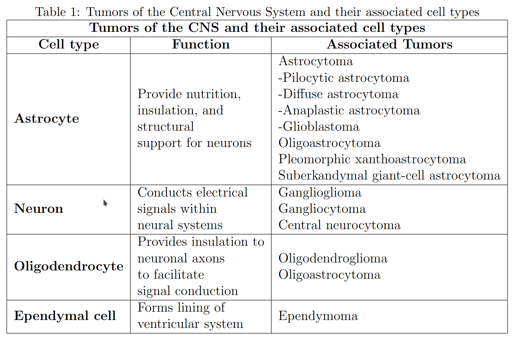
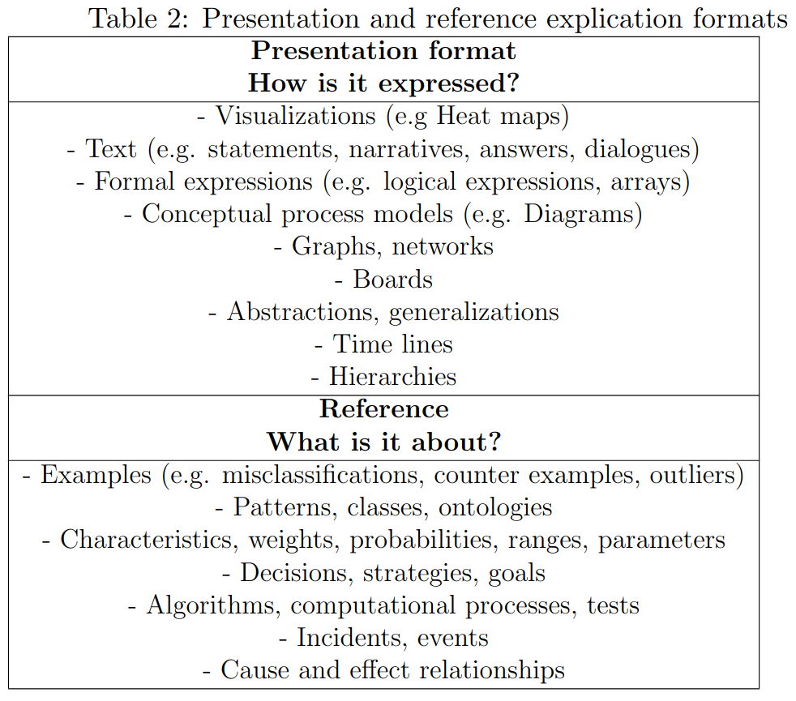
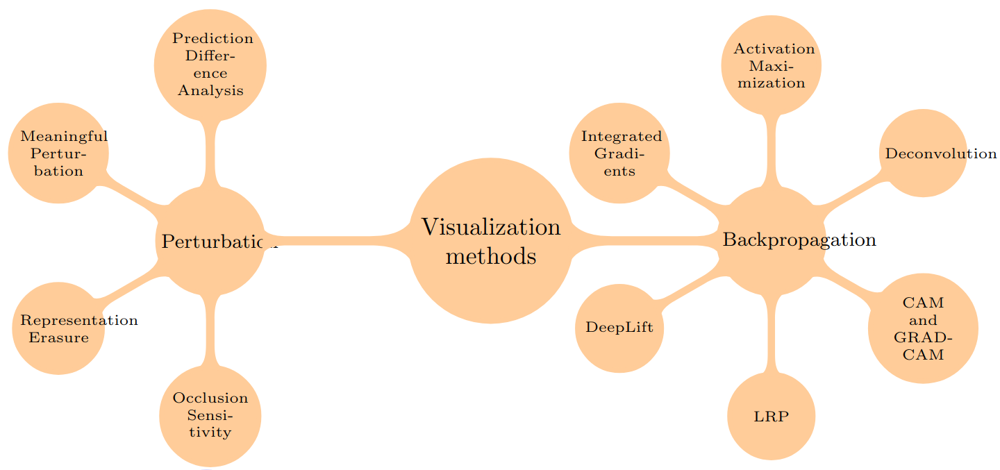
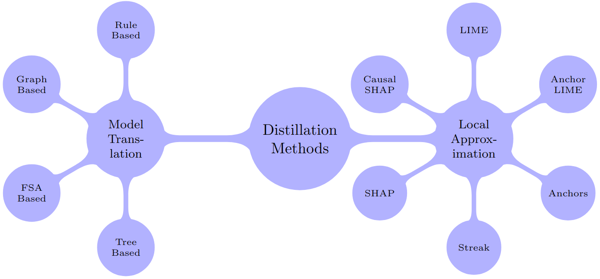
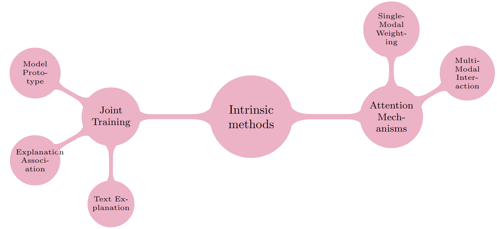
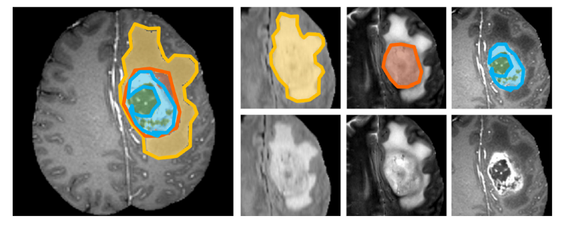
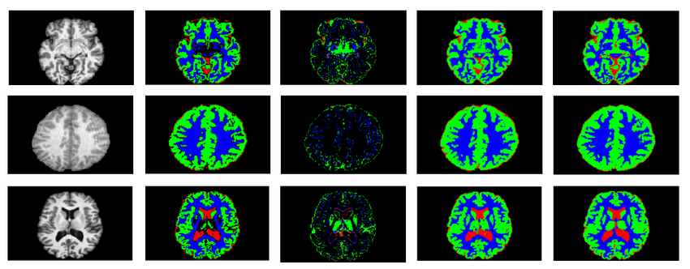
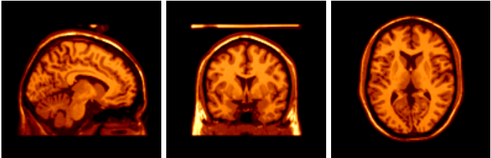
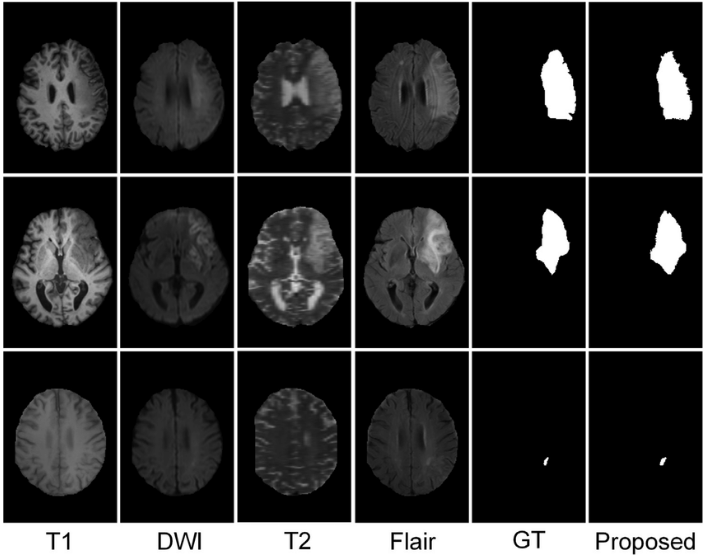

# 
 Explainable AI Implementation for MRI brain tumor detection: A survey

Brain tumors are considered a severe disease, in which time misuse or fortuitous errors can put a person’s life in jeopardy. Diagnostic skills of brain
anomalies vary depending on their experience of the doctor; however, there
is consensus about the immense importance of Magnetic Resonance Imaging
in the diagnostic process.
To support the diagnosis process, Computer Aided Detection (CADx)
is implemented. CADx processes digital information to be able to obtain
further details of a disease, as well as, simulate the deductive inference process
of professionals to support their final decision. However, CADx systems’
output rarely constitute fully-understandable nor reliable tools, which in turn
means there is room for researching CADx
Recent literature suggests that Explainable Artificial Intelligence (XAI) is
a widely acknowledged research field that holds substantial promise for the
more accountable artificial intelligence-based systems. XAI will and does
play a crucial role in medical applications, nonetheless, the answer to how
novel studies tackle the trade-off between accuracy and explainability fails
to be fully explored and could be further scrutinized. Similarly, achieving
consensus on explainable evaluation metrics is still in infacy.
This survey aims to bridge the gap between CADx and XAI by making an
exhaustive literature review and comparison among state-of-the-art methodologies for Brain Tumor Detection based on Magnetic Resonance Imaging.
Also, this review features an analysis of the common metrics and key performance indicators considered for a respectable explainable evaluation.

## Introduction
Cancer is considered the second leading cause of death after cardiovascular diseases [1]. According to the American Cancer Society (ACS) cancer
is considered one of leading public health problems across the world. The
ACS statistics of new cases of cancer across the United States lead to the
interpretation that this illness should be considered of great relevance as it
compromises the well-being of a compelling group of people. In spite of the
decline in cancer rates since the 1990s, the number of cases is still significant
[2]. It must be emphasized that out of all types of cancer, brain cancer has
the lowest survival rate [3]. Malignant brain tumors account for a disproportionate burden of cancer mortality because of their low survival rate; only
one-third of individuals will endure at least 5 years after diagnosis [4].
As for today, in clinical practice, doctors and medical practitioners have
to manually identify a tumor’s existence for the prescription of subsequent
medical treatments.
An early cancer detection is required for increasing full recovery chances
[5]. Despite the passing of time, there is still a significant percentage of misdiagnosis in medical imaging. For instance, an analysis of the Comparative
Benchmarking System (CBS) of the insurance program (CRICO) [6] reviewed
in depth 29,777 cases of medical malpractice. 1325 cases named radiology as
the primary responsible service, of which 42% turned out to be high severity
cases. Thia release that the task of classifying tumor images can be seen
as trivial from a merely computer vision approach. Medically speaking, images are too diverse and require high expertise to be accurately interpreted.
There is a remarkable need of developing efficient, transparent, nonprone to
error tools in the medicine. Strides in Machine Learning (ML) have led to an
emerging trend of developing Artificial Intelligence (AI) systems in diverse
range of fields. ML is powering several medical applications and there is a
significant interest on using Deep Learning (DL) along with Neural Networks
(NNs) due to their advantages while recognizing images [7]. CADx systems
can improve clinical performance by reducing not only misclassifications, but
also misinterpretation of images that may lead to incorrect prescriptions of
certain treatments. Outputs of assisted diagnosis can be used as “second opinions”, to advocate for final diagnosis. CADx is an established concept
that has equal participation of doctors and computers [8].
Along with the AI developing field, the necessity for explanations backing
up the model’s results have also emerged. When a significant medical decision
must be made, an AI that suggests a course of action with reasonable evidence
and transparency, rather than simply define one is desired [9]. Explainable
models estimate the influence of all features on the model predictions [10],
granting tools and methods for a better understanding and interpretation of
deep learning outcomes. An explanation is any information that can help
the user understand and communicate to others why the model exhibits a
particular decision-making pattern [9] [11]. For medical AI applications as
CADx to be accepted and included in clinical practices, Explainable Artificial
Intelligence (XAI) is determining.
However, a thorough analysis of novel approaches and methodologies of
CADx including XAI have highlighted the lack of established XAI evaluation, as a result of the nonexistent consensus in key performance indicators of
inteterpretability, implying the need of an urgent definition of explanability
metrics. According to [12], only 5% of the studied papers until 2018 by this
survey focused on assessing interpretability methods. Furthermore, there is
an evident scarcity in studies contemplating a proper XAI evaluation in collaboration with professionals in the field [13]. Out of 22 studies from 2019 to
2022, only three approaches [14] [15] [16] evaluated the model effectiveness
with professionals. Despite the development of some general-purpose explainable approaches, interpretability is a domain-specific concept [17] [18],
meaning that there cannot be an all-purpose solution [19]. It is imperative
to take into account the application domain and use case for each problem,
that is to say, Brain Tumor Diagnosis. This survey will further develop the
stated gaps and showcase opportunities as well as future research needs.
This paper is arranged as follows. Section II explains the used strategy
followed to successfully scrutinize the state-of-the-art research and develop
the survey. Section III provides some detailed background explaining concepts and the basis of neuroscience with some medical insight. Section IV
discussed image recognition and its application prospects in medical imaging.
Section V explains CADx and showcases projects in the field, while section
VI focuses on CADx focused in brain tumors. Section VII describes XAI
and its characteristics and section VIII develops on CADx focused on brain
tumors with XAI. Section IX and X highlight important aspects about the
reviewed approaches. Section X discloses the importance of XAI evaluation Finally section XI and XII presents a final discussion and conclusions.

## Research Strategies
The methodology and systematic approach was performed under the following criteria: First, the main ideas and concepts were analysed in an initial
and superficial overview. Then a scoping review was performed to be familiarized with the topic. Second a deeper research took place to find significant
information (information retrieval) and milestones in the development of the
state of the art. In this phase a protocol was constructed for critically evaluating the relevance of the found articles and books. Third, the found body
of knowledge was analyzed, critical hypothesis were made based of results
and conclusions, to finally make an exploration of assumptions, limitations
and areas of uncertainty.
The review included all articles that were relevant, directly linked to the
keywords, and current, no earlier than 2018, and were published in high
known journals or databases. The main keywords for the literature search
were: Explainable Artificial Intelligence (XAI), Machine Learning (ML), Interpretability, Computer Aided Diagnosis (CADx), Diagnostics, Magnetic
Resonance Imaging (MRI) and Brain Tumor. Additionally, the vast majority of the research papers cited in this survey were found in: Scopus, IEEE
Xplore, PubMed, Google Scholar, ResearchGate, ScienceDirect and ACM
digital library. The search strings used in this survey included, but are not
limited to:

• TITLE-ABS-KEY( (Explainable Artificial Intelligence) OR XAI OR (Explainable AI) OR Diagnostics). 

• TITLE-ABS-KEY( (High Computation) OR (Brain Tumor) OR (Explainable AI)).

• TITLE-ABS-KEY( (Medical Imaging) OR MRI OR (Brain Tumor)).

• TITLE-ABS-KEY( (Brain tumor) OR MRI OR (Explainability)).

• TITLE-ABS-KEY( (Magnetic Resonance Imaging) OR (Deep Learning) OR (Brain Tissues)).

Articles that described methods for diagnosis in different context than AI,
articles that described the philosophy of explanation, duplicated or republished articles, articles published in workshops and technical reports, were all
excluded.

## Background
Physicians will follow a series of steps to understand a magnetic resonance image [20]. First step is to identify the scan, the imaging sequence, and the slice. Then they will look for asymmetry. Next, they will need to identify the lesion causing the asymmetry, and its density/intensity, decide if contrast enhancement pattern may be useful, and locate the lesion in the extra-axial compartments (outside the brain), or intra-axial compartment (in the brain parenchyma). This methodology carries out a lot of responsibility. Moreover, the person carrying out this decision has to have gone through an extensive preparation journey to be specialized in diagnosing and treating diseases of the Central Nervous System (CNS). Neuroradiologists are Graduates of medical school, that completed a four years long residency in radiology, concluded four months of mandatory training in radiology, were then eligible for the radiology board certification and completed a fellowship of two additional years of specialized training [21]. On average neuroradiologist have more than 10 years of training after their undergraduate education. The role of radiology in diagnostic error [22] states that the process of medical diagnosis involves a compound network of interactions between the patient and the healthcare system. Being a dynamic process in need of multiple interaction cycles with the patients, failure can arise at any given stage, which may result in late or inaccurate diagnosis, as well as inappropriate treatment. Cancer can be the source of almost any symptom but once neurooncology clinicians have enough evidence to suspect a patient might have cancer [23], they will ask about the family medical history and perform a physical exam. Then, doctors will run a series of diagnostic tests, including lab tests, endoscopy, biopsy and imaging tests. Imaging can be useful for reasonable differentials. The central nervous system (CNS) also known as neuraxis, consists of the brain (encephalon) and the spinal cord (medulla spinalis). The CNS connects information from the entire body and coordinates activity across the whole organism [24]. Any type of brain tumor can cause considerable problems as the rigidity of the skull leaves no room for the tumor to expand [25]; for example, if tumors expand to parts of the brain that control vital functions, some derived problems include feeling of weakness, complications in walking, trouble with balance, partial or complete loss of vision, difficulty understanding or using language, and complications related to memory. Although the etiology remains relatively unexplored, the classification of brain tumors has progressed in parallel with expanding molecular understanding and advances in detection and diagnosis. Thus, brain tumors can be classified into two main categories, Malignant (cancerous, 29.7% of tumors) and Non-Malignant (benign or noncancerous, 70.3% of tumors) [26], statistical distribution found in Fig. 1. Malignant and nonmalignant brain and other CNS tumors constitute a numerous assemble of over one hundred histologically specific sub-types with distinct epidemiology and clinical characteristics according to the 2021 WHO Classification of Tumors of the Central Nervous System [27].

![ Figure 1: Distribution of Brain Tumors, classified as the two major categories. Data obtained from [28]. ](images/pie-2types.png)

*Figure 1: Distribution of Brain Tumors, classified as the two major categories. Data obtained from [28].*

All forms of cancer are revealed to involve dynamic modifications in the genome which means that they arise from alterations of critical cellular functions such as apoptosis, proliferation, and tissue invasion [29]. In fully developed brains, neural stem cells and progenitor cells (glia) commonly possess features associated with cancer of the CNS, including a robust proliferative potential and a diversity of progeny [30]. Actions among molecules in a cell that lead to certain product (cellular pathways) that operate in many brain tumors, do also regulate neural stem cells [31]. Further analysis suggest that stem and progenitor cells in the CNS are at major risk of tumorigenesis. Malignant gliomas are the most common primary brain tumors, and glioblastomas are among the deadliest of human cancers. Despite being recognized and treated since the middle 19th century, nowadays improvement in its survivability has not increased substantially. The predominant histologic subtype for malignant tumors are glioblastomas. In Table 1, tumors of the CNS and their associated cell types are described, glioblastomas originate in glial astrocyte cells, this type of tumor accounts for nearly half, 48.6%, of all malignant tumors in all ages combined, as seen in Fig. 2. According to the World Health Organization (WHO) [32], malignant brain tumors are classified into grades I to IV and glioblastomas are classified as a grade IV tumor.

![ Figure 2: Classification of malignant brain tumors and their incidence rate. Data obtained from [28] ](images/pie-malignant.png)

*Figure 2: Classification of malignant brain tumors and their incidence rate. Data obtained from [28]*

## Medical Image and Computer Vision

Medical imaging is defined as a technique that produces images of human organs that help identify and treat diseases by making nondestructive scanning of a certain soft tissue. Magnetic Resonance Imaging or MRI is a medical imaging procedure that is non-invasive and does not inflict any pain. This modality has evolved from being a method with a bleak future to be one of the most used in medicine. MRI was introduced in the 70s and has become nowadays the imaging method of choice for a large proportion of radiological examinations [33], It is considered to be one of the most accurate techniques for cancer detection and classification of images on the brain tissue, as it gives rich data for clinical analysis and biomedical research [34]. As described by McRobbie et al. [33], the reason MRI is vastly used is that allows the user to produce images with a wide range of contrasts by using different imaging techniques (known as pulse sequences) and by controlling the timing of the sequences. This makes it possible to make the tumour dark and brain tissue brighter. All MR images are produced using a pulse sequence, which is then stored in the scanner computer. The sequence contains radiofrequency (RF) pulses and gradient pulses which have carefully controlled duration and timings. The gradient pulses make the characteristic ‘knocking’ noise when the image is acquiring a scan. Many different types of sequences can be performed, but they all have timing values called Repetition Time (TR), and Time to Echo (TE), which can be customized. TR and TE are set in order to get the required image contrast. MRI uses the natural properties of hydrogen which, as part of water or lipids, makes up 75–80% of the human body. The most important properties are the proton density (PD), and two characteristic times called spin-lattice relaxation time and spin-spin relaxation time, denoted T1 and T2, respectively.

*Table 1: Tumors of the Central Nervous System and their associated cell types*

In medical imaging analysis, brain imaging analysis is considered imperative [35]. However, brain tumor recognition through MRI is quite a
challenging task due to the complex structure of the brain, high diversity in
appearance of tumor tissues and great pathology variations [36]. Researchers
and doctors can take advantage from computer-assisted interventions as they
have great data management. DL has made a big leap helping in the identification, classification and quantification of meaningful patterns in medical
images. Meaningful feature extraction is the key to its success. DL innovations, like image recognition, have relieved [37] the necessity of handcrafted
features mostly designed based on domain-specific knowledge, turning it into
the learning step of a system exploiting hierarchical feature representations
learned entirely from data. Part of the success of deep learning are closely related to the following factors [38]: advancements on Central Processing Units
(CPUs) and Graphics Processing Units (GPUs); availability of a extensive
amount of data; and the development of learning algorithms ([39], [40], [41]).
Nowadays large quantities of image information are generated daily in
various clinical settings [42]. The information in the form of images, can be
learned via AI, IR, and ML. Computer vision is by definition, a branch of
AI which objective is to understand and automate tasks emulating human
vision perception [43]; therefore suitable for medical imaging. Computer task
are quite varied [44], some of the most relevant are image recognition, image
segmentation, feature detection, among others. An author [45] describes
them in further detail. Image recognition analyzes and recognizes all of the
constituent objects of a scene. Image segmentation performs the task of
finding groups of pixels that belong together (are part of the same element).
Feature detection identifies characteristics of an image.
Describing this notions more in depth; image classification perse, portrays
an important role in CADx and is a considerable challenge on image analysis
tasks [46]. Its objective are reaching a high accuracy and at the same time
identifying which parts of human body are compromised by the disease. In
MRI, segmentation plays an important role, specifically in abnormality detection, quantitative analysis, and postsurgical assessment. Segmentation of
medical imagery is a critical problem due to the dimensionality of images,
limitations of equipment, and position of patient, as manual segmentation
from the large MRI volume is a complex task to clinicians [47]. Moreover,
significant problems regarding technical factors (such as geometry, contrast
and background) preventing an appropriate automated interpretation of an
image, may be overcome.
The advanced computerized methods [48], CADx, give solution to these
difficulties, accelerate the treatment time and also increase the accuracy. Insight in some solutions can disclose numerous benefits, such as absence of
need for time breaks, the lack of humanistic implications (biases, lack of
knowledge, or clerical errors) and the continuous progress of artificial intelligence in its innovative capacities.

##Computer-Aided Diagnosis
The foundation of the development of Computer Aided Diagnosis or
CADx are: a defined strategy of detection and quantification, proof of success and the promotion of a wider acceptance of CADx globally [8]. An
appropriate diagnosis and situation management requires the very best skills
a neuroradiologyst has acquired, as well as, the experience and the insight
into human nature and frailty [49]. The CADx systems can improve clinical
performance, reducing not only the misclassification but also the misunderstandings of images that may cause the correct treatment to be neglected.
An explanation is defined as any information that can help the end-user to
understand and communicate to others why the model exhibits a particular
decision-making pattern [9].
Computer-aided diagnostic systems are becoming increasingly important,
CADx is a trend clearly noticeable in the literature. In 2002, a modern
approach was developed to diagnose and manage acute pain on the sides
of the torso [50], a fairly common and complicated problem, whose causes
are mainly urinary anomalies. The approach proposes two diagnoses; Intravenous Pyelography (IV) and Unenhanced Helical Computed Tomography
(UHCT). Its outputs exhibit this proposal superior precision for the detection of kidney stones and demonstrate the advantage of the use of CADx
since the beginning of the 21st century.
These systems have been used with multiple types of cancer. For instance in 2012, a diagnostic system for breast cancer based on Doppler color
flow imaging was developed [51]. In this project, the HSV color space-based
classification combines ultrasound imaging in B-mode with Color Doppler
Flow Imaging (CDFI). At the same time, this process is complemented by
the vector algorithm based on color coherence, helping to quantitatively estimate distinctive parameters. A CADx for prostate cancer [52] was also
proposed, its objective was to emphasize intelligent systems potential in clinical practice, helping in analysis and classification of tissues involved in this application. CADx systems based on tissue structures, like this, employ
feature vectors derived from measurements of the size, shape, and spatial arrangement of gland units, lumen, epithelial cytoplasm, epithelial nuclei, and
other tissue structures to distinguish its patterns. This tissue-based system
supports that the accuracy of biopsy image interpretations is superior with
CADx.
More recent studies prove the veracity of CADx systems in diverse medicine
disciplines. The first ultrasound study of fatty liver kurtosis with clinical experimental validation was proposed in 2016 [53]. Research findings suggest
that similar imaging may be useful for the development of more CADx tools
to assist clinicians in fatty liver detection, thus other conditions as well. CASDES, a computer-aided system for dry eye syndrome diagnosis [54], shows
the applicability and robustness of CADx in ophthalmology and supports
related eye diseases’ diagnosis, such as meibomian gland dysfunction.
CADx has also been involved in dermatology. A diagnosis of melanoma
lesions was developed using DL and supervised algorithms [55]. It can classify and predict melanomas, image enhancement was performed using Median
Filters and histogram equalization was performed by Contrast Limited Adaptive Technique (CLAHE). This approach implemented Normalized Otsu’s
Segmentation (NOS) algorithm to segment and separate lesion-affected skin
from normal skin, be doing so overcoming illumination problems. Finally,
it uses Hybryd-Adaboost SVM (Support Vector Machine) for classification.
This CADx system assists dermatologists in diagnosis decision to avoid unnecessary excisional biopsies. Similarly, in 2017, it is presumed that the first
CADx with CNNs (Convolutional Neural Networks) was proposed for the
classification of thyroid nodules [56]. The model can automatically extract
effective features from 2D thyroid nodule ultrasound images, showing once
more the improvement in diagnostic performance by applying AI.
CADx focused on brain tissues have also stood out such as, segmentation
of arteries and veins of the cerebral vasculature [57], and automatic diagnosis
of Alzheimer’s [58]. Among the most recent diagnoses, some worth mentioning are, the automated analysis of atrophy patterns in dementia with Lewy
bodies [59], reproducible neuro-imaging functions for the diagnosis of autism
spectrum disorder [60], early diagnosis of cognitive impairment mild [61],
model to identify multiple sclerosis in the brain with FLAIR [62], among
others.

## Computer-Aided Brain Tumor Diagnosis
Improvement in brain tumor diagnosis has been an object of study for over a decade. Among the CADx systems, specifically the ones focused on brain tumors, several approaches excel in providing decision support for neuroradiologists. In 2006, Chaplot et al.’s proposal was an important precursor in the field [63]. Their approach compared methods for brain anomaly detection, and they managed to achieve 94% of precision when using Neural Networks Self Organizing Maps and 98% of precision when using Support Vector Machine. This suggested SVMs were more reliable for normal and abnormal MRI classification. Previously, morphological reconstruction for image analysis proposed in [64] was another important milestone. Reconstruction extracts the connected components of a binary image I (mask), which are marked by a (binary) image J contained in I. The reconstruction is the union of the connected components of I that contain at least a pixel of J. Later in 2014, a Fully Convolutional Network (FCN) that used a small architecture with small (3×3) convolution filters was proposed by [65]. The investigators’ goal was to enhance a usual contracting network by adding successive layers, where pooling operators were changed by upsampling operators. Consequently, these layers increased the resolution of the output. High resolution features from the contracting path were combined with the upsampled output for localization. Thanks to this enhancement, the successive convolution layer could learn a more precise output. This was the foundation to future networks and training strategies focused in biomedical images [66]. As for 2017, two precedents for automatic brain lesion segmentation can be highlighted. Firstly, DeepMedic [67] employed parallel convolutional pathways for multi-scale processing by experimenting with the ISLES and BRATS datasets. Their dual pathway, each of them an 11-layers deep, three-dimensional CNN, was achieving compelling resultos for brain lession segmentation. Moreover, its dense training strategy joined the processing of contiguous image patches into one pass through the network while adapting to the class imbalance present in the data. Secondly, authors in [68] applied Soft Fuzzy Rough C-Means Clustering (SFCM) following the application of Soft Fuzzy Rough Approximations to obtain the rough regions of a brain image. This method was based in the acquisition of rough sets, embedding the concept of soft sets, rough sets and fuzzy set. As a benefit, this method was considered to be handling uncertainty by defining lower and upper approximation using a parametrization tool. In addition, the method reduced clustering mistakes and converged faster by setting a similarity coefficient and by initializing centroids effectively using histograms.

### From 2018 onwards
In [69], a DCNN was presented to segment brain tumors in MRIs using the BRATS dataset with the following methodology: preprocessing the data by applying intensity normalization, bias correction, mean subtraction, 2D slicing, cropping and data augmentation. Then, they applied three different networks architectures Interpolated Network (extends the original VGG architecture), SkipNet (five blocks and decoders), and SE-NET (with two approaches first, sub-sample pixel based up-Quine, sampling and downsampling; second, Squeezeand-Excitation block extension of SkipNet.), all consisting in a decoder-encoder architecture. Results demonstrated the benefit of intermediate Convolutional maps and interpolation techniques. In another research [70], three end-to-end models were proposed to segment Glioblastomas brain tumors. This proposal also used the BRATS dataset and stressed that Glioblastomas have different sizes, shapes, contrasts, and can appear anywhere in the brain. About the models, the first one, named ”Incremental XCNet”, generated CNNs models. The second model named ”ELOBA λ” was a strategy to train the CNNs models. This took into account the most influencing hyper-parameters (Epochs, Learning rate, Optimizer, Batch size). The third one was ”EnsembleNet” and combined the instances of ”Incremental XCNet” in parallel to get the benefits of each model based on a new non-parametric fusion technique. Another novel framework for brain tumor segmentation is presented using an integration of Fully Convolutional Neural Networks (FCNNs) and Conditional Random Fields (CRFs) [71]. In this work, pre-processing was based on a intensity normalization method. Then, segmenting image slices was done using deep learning models with integrated FCNNs and CRF-RNN from axial, coronal, and sagittal views, respectively. Finally, the segmentation results were fused to apply a robust intensity normalization method and correcting the bias field using N4ITK.

### From 2019 onwards
The year 2019 already had considerable methodologies for brain tumor detection, such as [72], which was a method meant to extract brain tumor from 2D MRI by applying clustering with Fuzzy C-Means clustering and traditional classifiers as well as CNNs. The traditional classifiers applied were K-Nearest Neighbor, Logistic Regression, Multilayer Perceptron, Na¨ıve Bayes, Random Forest, and Support Vector Machine. Among these, SVM achieved highest accuracy of 92.42%. The implemented CNN achieved 97.87% of accuracy with an 80:20 split ratio (80% training images and 20% testing images). Enhanced Convolutional Neural Networks (ECNN) is proposed altogether with loss function optimization by BAT algorithm for an automatic segmentation method of MRI images [73]. Preprocessing consisted in skull stripping and image enhancement methods. Segmentation was done by applying Hybrid Convolutional Neural Network (HCNN), and its Loss function was optimized using the BAT algorithm. BAT algorithm is used for automatic segmentation based on the echolocation behaviour of bats [74]. Other uncommon methods are also used. In [75], authors proposed bagging, which is an approach for ensemble learning that reduces the generalization error by combining multiple models or classifiers. This method presents the learning algorithm with a training set that consisted of m training examples drawn randomly with replacement from the original training set of m items. A CNN-based method for classifying Glioma brain tumor MR images was proposed in [76]. Genetic Algorithm (GA) was used to specify, search, an appropriate network architecture with far less computations. Bagging Algorithm was applied on the best network suggested by GA, it improved the accuracy, architecture (structure) of the CNN evolved using GA, to decrease the variance of prediction error, bagging was utilized. A CUDA-based FCM method for medical image segmentation was developed in [47], which proved the importance of enhancing the splitting an image according to the inner sections’ characteristics. The FCM was used due to the overlap between data points, but it is also enhanced by GPU. Then, four implementations were made: sequential FCM, and parallel PFCM-v1, PFCM-v2 and PFCM-v3. Parallel implementations had better results in terms of runtime processing compared to the sequential one. A technique using SVM for slice detection, FCM for extraction, and PLPT for substructure segmentation for brain tumor MRI images were developed [77]. This rapid and automatic method for brain tumour detection was tested with the BRATS dataset. Another work states a fused feature adaptive meta heuristic firefly backpropagation neural network for classification [78]. First, pre-processing consist of denoising and the use of average filter for reducing the intensity variation of the images. Then feature extraction is done by Gabor wavelets (Gabor wavelet identifies the locality, orientation, and frequency of the image by using a wavelet transform which provides texture information of spatial and frequency domain), feature selection is done by kernel principal component analysis (KPCA, it uses PCA with the kernel parameters in the kernel space) and feature fusion is done by the Gaussian radial basis function (GRBF).

### From 2020 onwards
Another CADx for the automatic segmentation and classification of MRI images was proposed using cognition the Modified Level Set algorithm and optimized ANN classifiers [79]. For starters, pre-processing steps was applied to reduce noise such as RGB to Grey conversion, Histogram Equalization method, Median Filtering; Then segmentation was carried out using Cognition based Modified Level Set algorithm. In order to classify the segmented images into normal, benign and malignant samples of brain MRIs, important image features were extracted using Multilevel wavelet information (Multilevel wavelet decomposition gives the information about frequency components of the image and improves the information about the image for further processing). Afterwards, for the wavelet coefficients modified chief descriptions like Grey Level Co-Occurrence Matrix (GLCM), Gabor and moment invariant features are extracted. Finally, the classification was carried out by adapting an ANN classification method (an artificial intelligence technique that resembles the operation of human brain which can reflect the basic linear or non-linear connections between input and target information). In [80] a method using a deep CNN for feature learning and extraction to diagnose brain tumors was shown. It was seen that classification with Deep CNN in terms of its feature learning accuracy and sensitivity is highly dependent on the number of utilized epochs. Pre-processing methods used were: resizing, denoising, and data augmentation (which used used rotation, scaling, reflection, translating, and cropping.) Ideal number of epochs was 15, and image classification was assisted by fully connected softmax layers. In the pasing year, a method using deep learning convolutional neural network with transfer learning for brain tumor subtype classification was developed [81]. Non-deep learning methods based on hand-crafted features altogether with deep learning methods based on transfer learning using softmax as classification were optimize and applied. Deep features extracted from ResNet101 were classified with KNN and SVM. GoogleNet and ResNet101 with transfer learning approach were optimized for CNN. This paper states the importance of classification of brain tumor subtypes. None of the proposals mentionated before incorporated XAI. Explanations backing up the output of a model are vital, especially in the medical sector, where experts require far more information from the model than a simple prediction. CADx systems require a high level of accountability and thus transparency. In contrast, black-box models are not applicable [11] if explanations about the inference desicions are not provided [11]. XAI altogether with Interpretable ML is an open and active field of research, with approaches continuously being developed. Advances in the field offer ways to unveil black-box models and pursue two main goals, performance accuracy and explanation, redefining trade-off between them, building trustworthy algorithm and achieve fairness [82]. Even if new techniques are emerging quickly, some crucial challenges remain yet to be solved and further research is needed to advocate for the progress in this field [83].

## Explainable AI
Nowadays, different artificial intelligence algorithms are used to complement and support decisions in tasks in many areas, such as education, construction, medicine, news, entertainment, logistics, law and finance, among others [82]. Although these algorithms fulfill the objective of helping users in specific tasks, they still are not totally accepted. Users question proposed decisions when there is no way to interpret the system’s logic [84]. Numerous studies have related trust to explainability in the field of intelligent systems. The article [85] inquieres into this topic. Intelligent systems are more reliable if their predictions are explained. Explanations should provide information answering to [86]: When, why and how the results might change or be different? It is especially important for XAI to differentiate between a good explanation for someone in the field, that is to say, a person who has knowledge of architectures and technicalities, and a genuine explanation for the end user. Early in the development of XAI, offered “explanations” should not have been called like that, but rather “verbalization of knowledge”. The material that is offered as an explanation, regardless of its medium, format, or reference, is only considered an explanation if it has explanatory value for particular individuals [87]. The acceptability criterion (“goodness”) is introduced as an acceptable notion to define when an algorithm is good enough and how it can be compared with others [88]. It would not make sense to offer an argument if it cannot be understood by the target subject.

*Table 2: Presentation and reference explication formats*

The author of [11] arises the questions: Who is responsible if things go wrong? Can you explain why they went wrong? And if things went well, how can we repeat it? In medicine, making a mistake is not an option. Interpretability in the medical sector contemplates factors, ignored by other sectors, such as risk and liabilities [89] [90] [91]. When choices are made, lives may be at stake, leaving such a vital decision to a machine that cannot hold any kind of responsibility would be the same as shirking responsibility altogether. Physicians and practitioners must fairly judge the usefulness of proposed interpretability methods, not just have at their disposal more likely irrelevant performance metrics. 
Felton, in 2017, identified four fundamental social and ethical aspects:

1. Transparency [92].
2. Accountability [93].
3. Safety and privacy [94].
4. Fairness and bias [95].

The ongoing improvement of CADx explainability for clinical diagnostics results in easy-to-use systems, better decision-making and problem-solving performance results [96]. As highlighted in [97], an unnecessary amount of mental effort is spent on complex radiology tasks, such tasks could be greatly benefited by AI applications such as CADx. Professional would direct greater efforts and time towards more complex tasks. Their opinion is decisive, however an specific application would make a great tool. Several academic papers in the XAI discipline highlight features and properties of solutions in this field of research, important notions can be found in [9].

Two types of explanations can be distinguished [84]:

1. Explanations that give insight into training and generalization (Intrinsic).
2. Explanations that give a perspective of the predictions (Post-hoc).

Methods and explainability goals are inherently related, they can be associated into three main categories, the most used methods in each category are mentioned above.

• Visualization methods: Disclose an explanation by displaying, through a scientific visualization, input characteristics that cause a strong impact on the output of a DNN.
• Model distillation: Develops a inherently explicable “white-box” model meant to imitate the input-output behavior of the DNN in order to identify the decision rules or great impact input features for the DNN outputs.
• Intrinsic methods: Specifically created methods to deliver an explanation along with its output. As a consequence of its design, these networks can enhance model performance and quality of the explanations.

The most common form of visualization methods are saliency or heat maps. These maps identify the input features that are most salient, in the sense that they cause the greatest response or have the greatest influence on the output of the model [98]. In the literature, theories about the types of explanation that should be presented have gained relevance, among them the Counterfactual Explanations and the Contrastive Explanations. Counterfactual explanations [99] are applicable to supervised machine learning settings where the desired prediction has not been made, it provides a link between what might have happened if a model input had been changed in a particular way. Contrastive explanations [100] clarify why one event occurred in contrast to another, they are inherently intuitive for humans to produce and understand. The article [82] stresses that techniques can be model-specific or model-agnostic. Likewise, these can be focused on a neighborhood around a specific point (Local Explanations) or give a generalized global response of the model (Global Explanations). Recent advances in XAI prove that there are ways to unveil black box models while pursuing two goals, accuracy and explainability, previously considered as incompatible.

## Computer-Aided Brain Tumor Diagnosis with XAI
Although XAI has already been applied to some brain-related diagnoses, they are still scarce compared to brain-related diagnoses without explainability. Among these; an XAI-based Multi-Modal detection and prediction Multi-Layer model for Alzheimer’s [101], interpretable complex representations in application to Alzheimer’s diagnosis and prognosis [102], the clustering model of explainable and statistically validated clustering applied to the identification of traumatic brain injury subgroups [103], the explainable machine learning model for early detection of Parkinson’s disease using LIME on DaTSCAN images [104], etc. Related specifically to tumors, a FLAIR-based algorithm for Glioblastomas Multiformes (GBM) [105] was developed with three innovations; First, a topological data analysis of GBM from the perspectives of tumor growth at the cellular level, evolution of GBM in the follow-up period, and finally, detection of GBM. Second, the incorporation of topological entropy called Shannon. Finally, as a third, a combination of topological and texture features for the interpretable model training. Despite having achieved a fairly high classification accuracy, 97%, the anatomical context is not taken into account. A new framework called NeuroXAI was also proposed with the aim of helping the interpretation of DNN behavior with visualization methods [106]. NeuroXAI is a post-hoc method, therefore, it can be used in any application, thus obtaining information about the behavior of these already trained models; however, it should be noted that this approach lacks quantitative evaluation of XAI methods to verify the quality and sensitivity of the generated maps and their relationship with precision metrics. Similarly, Explanability was modeled with OneClass SVM for anomaly detection with respect to understandability, representativeness, stability, and diversity [107]. Agnostic techniques were considered, meaning that they can be applied to any black box model. Clustering-based techniques yielded results that were similar to each other. The results were better when working with P@1 rules at the cost of comprehensibility, because of the number and size of the used rules.

## Data Collections
Reviewed articles validate and train their models using a broad selection of images. Most popular dataset used on prior works related to brain are:

### 9.1 BRATS
BRATS, The BRATS benchmark was organized as two satellite challenge workshops in association with the MICCAI 2012 and 2013 conferences. The challenge, presents a wide multiinstitutional routine clinically-acquired preoperative multimodal MRI scans of glioblastoma (GBM/HGG) and lower grade glioma (LGG), with pathologically confirmed diagnosis and available OS [108] [109] [110].

*Figure 3: BRATS data set semantic annotations of MRI images, yellow column whole
tumor, orange column tumor core and blue column active tumor[111].*

### 9.2 IBSR
IBSR, The Internet Brain Segmentation Repository provides manually-guided expert segmentation results along with magnetic resonance brain image data [112] [113].

*Figure 4: Segmentation results by [114] method on the IBSR18 dataset. From the left to right there is: the the input image, image predicted by GMM model for certain voxel, image predicted by DNN classifier for uncertain voxel, image combining GMM model and DNN classifier, finally ground truth image, respectively.

### 9.3 BrainWeb
BrainWeb, Simulated Brain Database (SBD) contains a collection of realistic MRI data volumes produced by an MRI simulator, that can be freely used by the neuroimaging community to evaluate the performance of various image analysis methods [115].

*Figure 5: Simulated image from the official website using the following parameters: Modality=T1, Protocol=AI, Phantom name=msles2, Slice thickness=1mm, Noise=3%, INU=20%*

### 9.4 ISLES
ISLES, Imaging data from acute stroke patients in two centers who presented within 8 hrs of stroke onset and underwent an MRI DWI within 3 hrs after CTP were included [116].

*Figure 6: Segmentation results on ISLES(SISS) 2015 dataset using the proposed framework on [117].*

### 9.5 MRBrainS
MRBrainS, this evaluation framework is to compare algorithms for segmentation of gray matter, white matter, and cerebrospinal fluid on multisequence (T1-weighted, T1-weighted-inversion recovery, and FLAIR) 3 Tesla MRI scans of the brain. Five brain MRI scans with manual segmentations are provided for training and 15 only MRI scans are provided for testing [118].

![images/MR.png]
*Figure 7: Visual results for two MRBrains subjects achieved by the different models. Top adapting a MRT1-trained model to MRT2 images and bottom a MRT2-trained model to MRT1 images.*

## Common denominators and metrics
It should be stressed that numerous approaches resembled in their systematic phases, the preeminent ones were pre-processing, segmentation and classification. On one hand, pre-processing stages were generally seen in numerous projects. Image Pre-processing aim is an improvement of the image data suppressing or/and diminishing undesired distortions as well as enhancing some image features important for further processing [119]. The vast majority of approaches used pre-processing techniques as an essential step in their systems. As described by [120] the most common preprocessing methods involving brain tissues are:

• Registration: an automatic spatial alignment of the images to a common anatomical correspondence space [121]. It aids in standardizing the MR images into a standard stereotaxic space, commonly MNI or ICBM. This method aims to align the images of diverse sequences to achieve a multi-channel representation for each location within the brain.
• Skull Stripping: The process of removing the skull from images [122] to focus on intracranial tissues
• Bias Field Correction: A method that aids segmentation and registration by correction the image contrast due to magnetic field inhomogeneity, caused by the linear increase of frequency needed to stimulate the nuclei under higher magnetic fields, being N4 bias field correction the most common one [123].
• Intensity Normalization: The process of mapping intensities of all images into a common reference scale; The majority of visualization and analysis methods have parameters, therefore, the setting of these parameters becomes more difficult without the same protocol-specific intensity meaning [124].
• Noise Reduction: The reduction of the Locally-Variant Rician noise observed in MR images, is a essential step to increase image quality and improve the performance for quantitative imaging analysis [125].

Since, Bias Field Correction and Noise Reduction were intrinsically related to the data set acquisition process via MRI, these are inferred to be the most relevant. Brain Tumor segmentation is crucial for tumor quantitative analysis in order to obtain accurate diagnosis and proper treatment procedures [126]. Specifically, in MRI brain images, brain tumor tissues such as solid or active tumor, edema and necrosis need to be separated from normal brain tissues such as grey matter, white matter and cerebrospinal fluid [127]. Segmentation and the subsequent quantitative assessment of lesions in MR images result on valuable data for the analysis of neuropathologies, thus for treatment strategies outlining, disease progression control and patient outcome prediction. Quantitative imaging can reveal key information about the disease characteristics and the effects on particular anatomical structures. Consequently the development of accurate, automatic segmentation algorithms has became a major research focus in medical image computing [67]. Segmentation techniques can be threshold based, edge based, region based or clustering based. [128]. Being segmentation a vital procedure, metrics are important as measurable values of quality. A collection of popular quantitative measures of brain MRI segmentation quality and their mathematical formulation [120] are described above.

*eqs set 1

Many approaches regarding segmentation were reviewed, and a form to compare them briefly was through these metrics. Where false positives FP, true positives TP, false negatives FN, false positve at voxel and lesion level FPL, true positive at voxel and lesion level TPL, and false negative at voxel and lesion level were considered. Classification techniques are widely used in CADx focused in brain tumor diagnosis, the most used and popular classifiers are K-Nearest neighbor, logistic regression, multilayer perception, naive bayes, random forest, SVM, among others. Some recurrent metrics using Machine Learning are described in 3. Their respective formulas are described below [72] [69].

*eqs set 2

Where true positive TP, true negative TN, false positive FP and false negative FN were considered.

## Explainability evaluation
Explainability evaluation is an area yet to be fully developed. Even if the used model by itself can be evaluated through AI metrics, the evaluation by itself has to also be asses in some way. As a matter of fact, AI metrics, such as classification accuracy, are sometimes considered an incomplete an inadequate description of most real-world tasks [129]. The competence to adequately measure the quality of XAI tools is decisive for stabilising technological advancements, understanding existing limitations, developing superior solutions, as well as, providing real-life applications. As XAI is a novel area of research, no unified consensus for methods nor metrics has yet been achieved by researchers in the community for its evaluation. However, despite the independent development of new approaches, authors often concur on notions about how this evaluation is ought to be done. The fundamental challenge in XAI evaluation is balancing powerful capabilities with technology that people feel empowered by [130], make the users feel in control. Lately, the need of understanding is more and more related to the need for institutional trust as this gives assurance to the end user. A survey on artificial intelligence assurance [131] defines this term as a process applied to all stages of the AI engineering life cycle to ensure that the outcomes are valid, verified, data-driven, trustworthy, ethical in its deployment, unbiased when learning, and fair to all users. The two main pillars of this definition are data and algorithms. Consequently, investigation regarding algorithm awareness, clarity, variance and bias where initiated [132]. Consequently, interdisciplinary collaborations are being further developed to generate research innovations to support this aspect of XAI evaluation.

Table 3: Machine Learning classifiers and comparative metrics
[!img](images/table3.png)

Even though XAI models can be generally evaluated qualitatively because evaluation still relies on human cognition, an objective approach is needed but yet to be recognized as it must be effortlessly comprehensible. A reason behind this unsolved problem is that interpretability is a very subjective notion, therefore, hard to formalize [17]. Interpretability can be defined as ”the degree to which a human can understand the cause of a decision” [133], it is also described as “the degree to which a human can consistently predict the model’s result” [134]. Ruping [17] stated that interpretability has three goals: accuracy, understandability and efficiency. Accuracy refers to the faithfulness towards to prediction it aims to explain, its the connection between the output of the explaining method and the prediction of the model. Understandability refers to the easiness of comprehension of an explanation by the end-user. Efficiency refers to the time that it takes the end-user to grasp the explanation, it should constitute a finite and rather short amount of time. There exist a trade-off between understandability and accuracy that is to say, a trade-off between the simplicity of the information given by the system on its internal functioning, and the exhaustiveness of this description [87]. However, generally speaking, the more understandable is an explanation, the more efficiently it is grasped. Due to the similarity of their meanings and goals, explainability and interpretability can be employed interchangeably. Nonetheless, measures of the computational accuracy of a formal model and measures of the goodness or explainability of the model from the user’s perspective, are totally different. Given the increasing number of existing interpretability methods, the urgency for comparing, validating, quantifying, and thus evaluating these has arised [12]. Objective metrics are vital for determining the trade-off between fidelity and performance. The evaluation on explainable approaches that do not consider objective metrics may lose interpretability and suffer from confirmation bias (a tendency to interpret information based of prior experiences) [135]. Moreover, metrics should engage within the same level of abstraction [136]. A growing number of researchers have been focusing in this area, a complete literature review focused on interpretability methods and metrics were presented by Carvalho [137] to identify future directions. Before considering XAI evaluation metrics is vital to recognize that explanations have different formats and therefore can be analysed through different categories.

The type of explanation that each method provides can be separated in [138]:

• Feature summaries: Summary statistics for each or some features.
• Model internals: Such as the weights in linear models.
• Data points
• Surrogate intrinsically models: An approximation of the original model

General guidelines for measuring explanations were proposed [139] considering three kinds of evaluations depending on the scope of the application, ranging from generic to specific, and relied on the involvement of automatic
proxy-tasks, non-expert humans, or domain experts. Evaluations were ccat-
egorized on:

• Application-grounded evaluation (end task): Performed by using the explanation in a real-world application and having it tested and evaluated by the end-user, who is also a domain expert.
• Human-grounded evaluation (simple task): This experiments are not carried out with laypersons instead of domain experts.
• Functionally grounded evaluation (proxy task): Which requires no human experiments, as some formal definition of interpretability serves as a proxy to evaluate the explanation quality.

It can be stated that [140] Human-Grounded evaluations are suitable for medical domains and if the explanation is limited to experts or something very specific such a medical diagnosis, Application-Grounded evaluations are the way to go.

### 11.0.1 Guidelines and metrics
All XAI methods should be transparent about their speed, accuracy and resource intensity. A criteria of evaluation can be determined based on the existing metrics for XAI evaluation. Recent papers [141] divide this evaluation metrics in two main groups. In one hand, metrics focused on technical specifications, and in the other, metrics based on sociological and cognitive characteristics. It is of paramount importance to consider the specific case of the use of XAI in the medical context. In this view, [142] suggest that an objective and complete evaluation of XAI should take into consideration a dual clinicaltechnical perspective. Assessing the clinical usability of the solution and at the same time evaluating the explanation through a general guideline. This general guideline should take into account.

• Understandablility: the explanation should be easily understandable by the personal without extra technical knowledge.
• Clinical relevance: the explanation should be optimal to merge with the decision-making pattern of physicians and support their reasoning.
• Truthfulness: the explanation process must reflect the model decision.
• Informative plausibility: information about the decision including flaws and biases to decide whether or not it is a decision of quality.
• Computational efficiency: the generation of an explanation should not exceed an amount not worth waiting for the patients.

Another study [143] concluded that XAI models that work specifically with convolutional neural networks can be classified as interpreting the CNN decision or interpreting the CNN architecture. Furthermore, it is important to understand if the metrics of such evaluations are Model-centric or Humancentric. The former, Model-centric metrics, are focused on the evaluation of explanations that use a model to explain a specific task using quantitative and qualitative metrics.

• Visualization: The production of visual interpretation to evaluate the performance expresses a qualitative form of human trust.
• Localization: Empoyed to evaluate the ability to capture most parts of the classified objects.
• Robustness: Evaluate the resistance against noised models or data, as well as the resistance against adversarial attacks.
• Classification Accuracy: A quantitative metric extensively applied to intrinsic models.

The latter, Human-centric metrics involve human implication in experiments regarding quality, deriving the discussion on subjective and objective metrics.

• Subjective Metrics: The interaction between two parties. The trustee is the party that trusted and the trustor is the party who trust, could generate trust when both act as expected without supervision. [144]. Clinical decision-support systems are able to improve trust and reliability in their deviation when explanations are added [145]. There is a demand for a proper balance between comprehensive and selective explanations.
• Objective Metrics: After some investigation [146] [147], researchers found that decision tables’ are found easy to understand by users, based on the time it took them to perform a task. Time would constitute a parameter able to be compared.

From a computation and optimization perspective, it is utterly important to quantify the quality of explanations. Some metrics quantifying the quality of global explanations proposed by [107] are:

• Accuracy: related to the usage of the explanations to predict the output using unseen data by the model.
• Fidelity: refers to how well the explanations approximate the underlying model. The explanations will have high fidelity if their predictions are constantly similar to the ones obtained by the black-box model.
• Consistency: refers to the similarity of the explanations obtained over two different models trained over the same input data set. High consistency appears when the explanations obtained from the two models are similar.
• Stability: measures how similar the explanations obtained are for similar data points. Measures the similarity of explanations using the same underlying model.
• Comprehensibility: related to how well a human will understand the explanation, it is affected by many subjective elements related to human’s perception (such as context, background, prior knowledge, etc.). In general terms, using the original features, while keeping the number of explanations generated and the features used to a minimum, will increase comprehensibility.
• Certainty: refers to whether the explanations include the certainty of the model about the prediction or not.
• Importance: inclusiveness of a weight associated with the relative importance of each relevant features.
• Novelty: explanations where the data point to be explained comes from a region of the feature space that is far away from the distribution of the training data.
• Representativiness: measures how many instances are covered by the explanation. Explanations can go from explaining a whole model, to only be able to explain one data point.

According to [148], quantitative percentage analysis of quality of explanations may include:

• Completeness: Input instances covered by rules over total input instances.
• Correctness: Input instances correctly classified over total input instances.
• Fidelity: Input instances with predictions and rules
• Robustness: When applying perturbations with no prediction changes, sum of differences between original and new predictions, divided by considered instances.

The intrinsic quality of explanations could be view from a field of cognitive science and psychology, in doing so, [149] states that this will make room for a more pragmatic and naturalistic approach to evaluating XAI methods. Some identified cognitive assessment metrics where:

• Explanation Goodness
• System Controllability and Interactivity
• Productivity and Use
• User Satisfaction
• User Curiosity and Engagement
• User Trust
• User Understanding

## Discussion
Due to the recent advances in AI, several statements raised concerns about job replacements, which included arguments regarding whether physicians, especially radiologists, will also be replaced in the near future. There have been many misleading arguments worth discussing that support this idea. For instance, an article in the New England Journal of Medicine stated that “Machine Learning will displace much of the work of radiologists and anatomical pathologists” [150]. Also, Harvard Business Review economists indicated that “when professional work is broken down into component parts, many of the tasks involved turn out to be routine and process-based. They do not in fact call for judgment, creativity, or empathy”, therefore, doctors could be replaced by AI. It has been even questioned whether we should continue training radiologists [151]. Contrary to common belief, we consider that physicians will not be replaced but rather take advantage of the new AI-based technologies as they have done before. History has demonstrated this on several occasions, but we begin our discussion by mentioning the interdisciplinary cooperation of William Morton and Edwin Hammer in 1896 [152]. While the former was a neurologist, the latter was an engineer, yet they worked together to produce important contributions in x-ray knowledge. AI applied to the medical field is still in its early stages, hence limited by the dearth of training and testing data, as well as, the minor breakthrough towards a unified regulation.

### 12.1  Current Technical Limitations
Limitations exist based on the characteristics of AI models. Algorithms need to be trained with a specific set of data to be able to identify an objective. On one side, training sets may have inherent errors and misinterpretations. On the other, models may not be able to further analyze data and, therefore, not identify other related abnormalities. A robust AI model is yet to be developed to have a broader perspective that could help automate the identification of syndromes and study the individual pathology of patients. Moreover, MRI devices are complex and imperfect machines that require extensive configuration. When they were first publicly commercialized, the demise of radiologists was speculated. Society used to compare AI algorithms to radiology experts based on the ability to identify a single disease [153] oversimplifying what radiologists do. However, Radiology recognizes nearly 20 thousand terms for disorders and imaging observations and over 50 thousand causal relations [154]. Physicians are able to identify uncommon diseases contrary to XAI tools. An article published by the Radiological Society of North America points out that “A radiologist’s knowledge of MR imaging artifacts is necessary to avoid confusion of artifacts with pathology and to maintain high image quality” [155]. Artifacts are visual anomalies present on magnetic resonance imaging that are not present in the original object [156]. Some common artifacts are patient motion, aliasing, power gradient drop off, metallic artifacts among others and doctors must be aware of methods that minimize their occurrence. It is true that image analysis projects that once took years now can be completed in short periods of time such as days or weeks, but a specialist’s full spectrum of knowledge is not replaceable by our current technology. AI tools facilitate the doctor’s workload and, are able to provide primary care or urgent care when physicians are not immediately available. Bearing comparisons of AI against physicians rather than analyzing the foreseeable improvement of their coalescence bolsters the erroneous expectations of AI in the medical field. In fact, we share The only underlying truth behind this comparisons is than in the future Radiologists who use AI will replace radiologists who don’t as Langlotz cleverly affirmed [157]

### 12.2 CADx systems for Treatment and Specification
The diagnosis of a disease is not a straightforward process. Currently, it cannot be made and/or communicated based solely relying on AI algorithms. The medical field is in fact greatly related to a patient’s emotional well-being. It is impossible to alienate the social aspect of disease treatment and diagnosis as it plays a major role in the quality of the healthcare outcome. For example, in [158] authors demonstrated that patients are more willing to disclose their aliments based on the physician’s empathetic and emotional response, facilitating the diagnosis. Furthermore, beyond an optimal diagnosis, the biggest predictor of adherence to treatment is trust in the physician [159]. How to approach a disease is almost as important as identifying it. Even though models may one day have sufficient information to determine the best decision path they may never fully replace humans. Patients value human connection and some prospects of this interaction such as interpretative skills, uncertainty awareness, legal ethical concerns, and adaptability. AI algorithms missing the ability to understand patient perspectives and preferences cannot care for them. Patients’ needs, values, preferences, and goals need to be considered when taking a course of action [160]. Models can assist radiologists, oncologists, and physicians through diagnosis, but they cannot provide a categorical solution. People in need require genuine care based on empathetic attention and at best AI can only provide emotionally unengaged care through representations and rule cases. Consequently, doctor’s emotional intervention and monitoring is fundamental and indispensable in the use of AI tools.

### 12.3 MRI and CADx application in Developing Countries

The major challenge for Latin America and the Caribbean are increasing accessibility and reducing inequity to brain cancer prevention, detection and care. Research on AI, big data and telemedicine could address these challenges, however,the promising adoption of digital tools are somewhat problematic and rely greatly on public funding. Moreover, it was reported that [161] cancer control in the region is highly inefficient, there are deficiencies in a great deal of areas such as professional training, disunion of health systems, poorly distributed budget, short-staffed hospitals, lack of therapy access, cultural and political barriers and insufficient equipment and infrastructure. The need for neurosurgery is still off the priority list of health support organizations in Low to Middle Income Countries (LMICs). The government and pertinent entities should be compelled to offer neurosurgical care considering local conditions, having had local training, be cost effective and promote treatment that reduces postoperative regimens. The shortfall of awareness on neurosurgical diseases has its roots in political, human, and technological factors. Consequences are associated to the high mortality in these countries [162]. Neuro-oncology depends on teams of highly specialized physicians. Specializations include neuro-oncology, neurosurgery, neurology, radiology, anesthesiology, pathology, palliative care among others. Neurosurgical care in LMIC is complicated. According to data in sub-Saharan Africa and similarly in Latin America, there is approximately 1 neurosurgeon per 7 million people, whereas in the United States, there is 1 neurosurgeon per 62,500 people. Global neurosurgery as a whole advocates for the improvement oh health outcomes and equity worldwide [163]. It is convulsory to conceive a responsibility regarding health inequity worldwide. Limitating surgical quick visits, establishing training programs ans integrating trainees in surgical activity and research is imperative. The quality of clinical outcomes should be measured regularly and designed to revamp. CADx helps not only in diagnosis, but also in other steps in cancer care such as treatment. Can be broadly used to promote equity on access and transparency, specially in rural health services. Mighty explainable algorithms of analysis can now have a resolution and scalability not witnessed before. Still, data is insufficient and the need for national administration is vital but obsolete time consuming regulations are preventing an easy transition to digital consolidation [164].

### 12.4 Current XAI trends and challenges

There has been a considerable amount of XAI methods, as in recent years its importance has been widely recognized in academia and industry. However, deep learning models are the first choice for most medical applications. This research area and approach has social implications as its end-users are doctors and patients, fast diagnosis could be reliably achieved and reduce mortality caused by the disease. It also has technology implications as it is not only contributing to XAI field development but also to and more acceptable use of CADx in real case scenarios. XAI will and does play a crucial role in medical applications due to the fact that it can increase the transparency of these models and gain trust from professionals in the field. In terms of AI performance, most of the researched studies performed well. However, only a few studies have provided XAI evaluations. It has been stated that explanations can be distinguished into two classes [88]:

• Non-pragmatic: The explanation must be the correct answer to the why-question. “A is the correct answer of X.”
• Non-pragmatic: The explanation must be the correct answer to the why-question. “A is the correct answer of X.”

The key difference between the classes is that non-pragmatic theories generally, but not always, follow a position where it is inferred there is one and only true explanation. Explanations must be pragmatic since no matter how scientifically rigorous or complete an explanation of how an ML makes a decision is, if users have difficulties understanding it, it is undesirable in the context of XAI. An author [133] points out that an explanation is not only a final product but also a process that involves a cognitive dimension and a social dimension. In one side, cognitive dimension is associated to knowledge acquisition where the causes of an event are identified and, then, a subset of these causes are selected as the explanation. On the other side, social dimension involves the social interaction, in which knowledge is passed down from the explainer to the audience, the goal is that the audience receives enough information from the explainer in order to understand the causes of some event or decision. These dimensions suggest the subjectivity of explanations, highlighting the need to adapt the explanation to the audience, specifically to doctors and patients. Therefore, it is essential to utilize and develop XAI methods instead of focusing in deep learning black-box development. Although there are many gaps and opportunities in the field the main ones that are believed to be more relevant to tackle in brain tumor classification are:

• Lack of professional collaboration
• XAI evaluation metrics parameters

An experimental showcase focused specifically for brain tumor detection with this considerations is yet to be developed, similar applications apply post-hoc XAI methods. In addition, most of the papers did not evaluate the models effectiveness by medical experts. Therefore, the answer to how these studies tackle the trade-off between accuracy and explainability could be worked on.

## Conclusion

Brain tumors have the lowest survival rates among all types of cancers, from all types of malignant tumors, gliomas are the most common and deadliest, any study should prioritize their identification. MR imaging is one of the most used methods and the literature suggests that is the best for identification of abnormalities in the brain. Computer-aided diagnosis is widely being more accepted. The essential steps of novel algorithms in the field, include: Preprocessing, Segmentation and Classification. Based on all collected information it can be stated that the incorporation of the most reliable XAI method to a robust algorithm for brain tumor classification, and distinguish parameters to make a proper XAI evaluation will make a contribution to the state-of-art investigation. Even though some metrics have been used, a globally accepted evaluation of explanability is to be developed. Explainability has to be focused in the audience, that is to say, doctors and patients, and has to be pragmatic. An effort to incorporate the most reliable XAI method to an state of the art algorithm for brain tumor classification, and distinguish parameters to make a proper XAI evaluation is imperative as suggested by the information retrived by this survey.

## References
On this repository.
